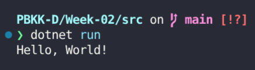
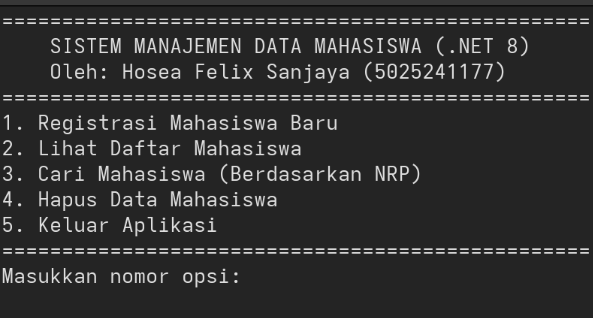
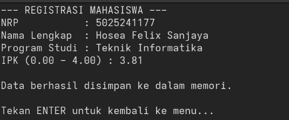
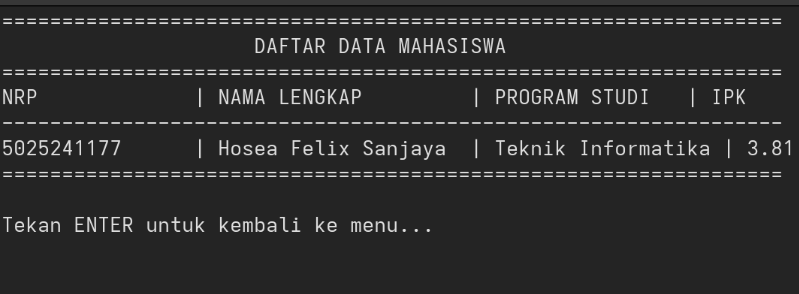
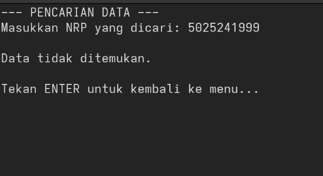
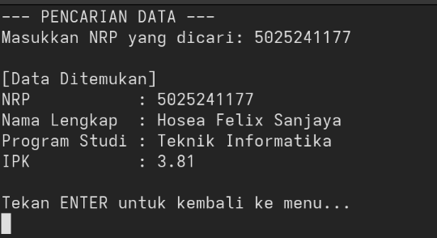
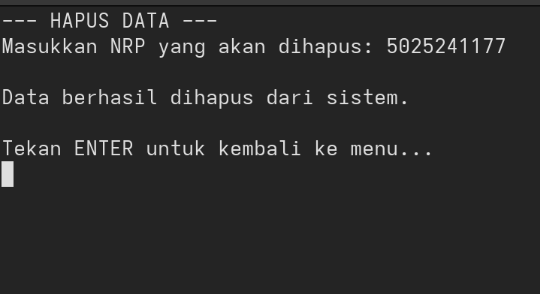
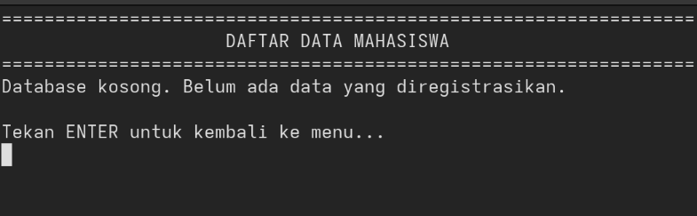

# Week 02 — Pengenalan .NET dan Sistem Manajemen Data Mahasiswa

**Nama**: Hosea Felix Sanjaya  
**NRP**: 5025241177  

## 1. Tujuan
Memahami fundamental bahasa pemrograman C# pada kerangka kerja .NET melalui pembuatan aplikasi konsol (Console Application). Fokus utama meliputi pemahaman sintaksis dasar, pembuatan model data (class dan object), penanganan input/output, serta operasi dasar koleksi data (List).

## 2. Uji Coba Sintaks Dasar (Hello World)
Implementasi dasar untuk memahami mekanisme output pada terminal.

```csharp
Console.WriteLine("Hello, World!");
```



**Penjelasan Teknis:**
* `Console`: Kelas statis bawaan dari namespace `System` yang merepresentasikan standar input, output, dan error stream pada aplikasi konsol.
* `WriteLine`: Metode dari kelas `Console` yang bertugas mencetak parameter string ke layar dan secara otomatis menambahkan karakter baris baru (new line) pada akhir string.
* `"Hello, World!"`: Argumen berupa tipe data string.
* `;`: Terminator wajib dalam C# yang mengindikasikan akhir dari sebuah pernyataan (statement).

## 3. Arsitektur Data: `Mahasiswa.cs`
Berkas ini bertindak sebagai model data (blueprint) untuk entitas mahasiswa. Implementasi lengkap berada pada `src/Mahasiswa.cs`.

**Penjelasan Teknis:**
* **Namespace (`DataMahasiswa`)**: Digunakan untuk mengorganisasi kelas dan mencegah konflik penamaan (name collision) dengan blok kode lain.
* **Properti**: Menggunakan sintaks `{ get; set; }` (auto-implemented properties) untuk atribut `NRP`, `Nama`, `Prodi`, dan `IPK`. Mekanisme ini menerapkan konsep enkapsulasi dasar tanpa memerlukan deklarasi variabel secara manual.
* **Konstruktor**: Metode khusus `public Mahasiswa(...)` yang dieksekusi saat instansiasi objek baru menggunakan kata kunci `new`. Berfungsi untuk menginisialisasi nilai awal dari properti objek berdasarkan argumen yang dikirimkan.

## 4. Pusat Kendali Program: `Program.cs`
Berkas ini memuat logika utama, antarmuka pengguna berbasis teks, dan manipulasi data. Implementasi lengkap berada pada `src/Program.cs`.

**Penjelasan Teknis Utama:**
* **Penyimpanan Data Dinamis**: Menggunakan `List<Mahasiswa>` dari namespace `System.Collections.Generic`. Berbeda dengan array statis, koleksi ini bersifat dinamis sehingga ukurannya dapat menyesuaikan jumlah data saat runtime.
* **Alur Eksekusi Utama (`Main`)**: Dikendalikan oleh blok perulangan `do-while` yang akan terus mengeksekusi antarmuka menu hingga pengguna memberikan instruksi terminasi.
* **Validasi Tipe Data**: Menggunakan `int.TryParse` dan `double.TryParse` saat membaca input. Metode ini mencegah runtime exception (program terhenti mendadak) apabila pengguna memasukkan format karakter yang tidak valid (misalnya huruf pada kolom angka).
* **Operasi Pencarian String**: Pencarian dan penghapusan data berdasarkan NRP menggunakan metode komparasi string `.Equals(nrpCari, StringComparison.OrdinalIgnoreCase)` agar pencarian tidak sensitif terhadap huruf kapital atau kecil (case-insensitive).

## 5. Dokumentasi

### Tampilan Awal


### Menambah Data Mahasiswa


### Menampilkan Data Mahasiswa


### Mencari Data Mahasiswa


<br>



### Menghapus Data Mahasiswa


<br>

