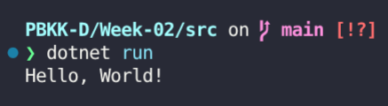
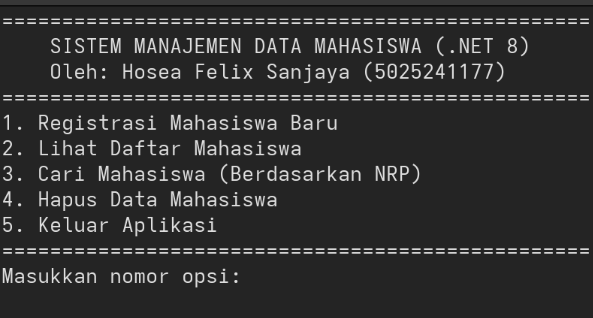
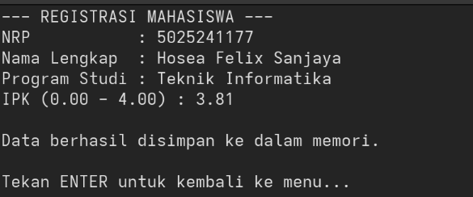
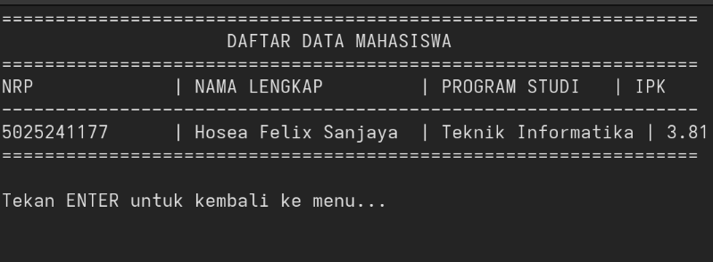
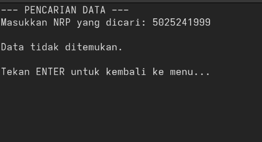
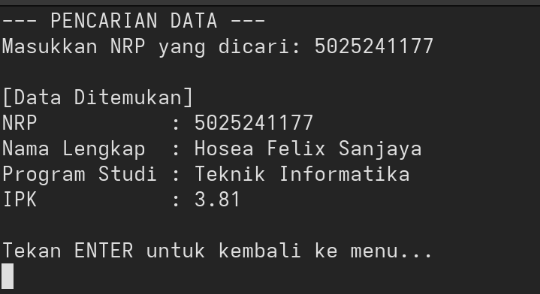
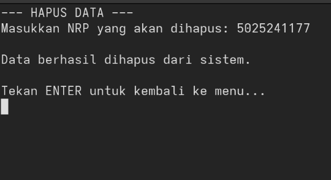
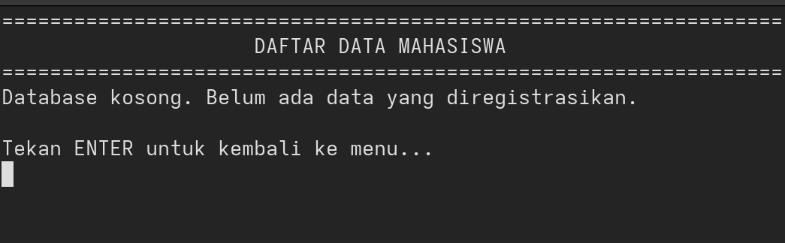

# Week 02 - Pengenalan .NET dan Sistem Manajemen Data Mahasiswa

**Nama**: Hosea Felix Sanjaya  
**NRP**: 5025241177  
**Kelas**: PBKK D

## 1. Tujuan
Belajar dasar C# di .NET lewat aplikasi konsol: sintaks dasar, class dan object, input/output di terminal, dan menyimpan data di `List`.

## 2. Struktur Project

```
Week-02/
├── README.md
├── img/
└── src/
    ├── Mahasiswa.cs
    └── Program.cs
```

## 3. Penjelasan Kode

### Hello World

```csharp
Console.WriteLine("Hello, World!");
```



`Console.WriteLine` mencetak teks ke terminal lalu pindah ke baris baru. `Console` berasal dari namespace `System`.

### `Mahasiswa.cs`

* Class `Mahasiswa` punya empat properti: `NRP`, `Nama`, `Prodi`, dan `IPK`, ditulis dengan `{ get; set; }` sehingga tidak perlu field terpisah.
* Konstruktor mengisi keempat properti itu saat object dibuat dengan `new Mahasiswa(...)`.

### `Program.cs`

* Data disimpan di `List<Mahasiswa>`, yang ukurannya bertambah sendiri tiap ada data baru. Data hanya ada di memori dan hilang saat program ditutup.
* `Main` menjalankan menu dalam loop `do-while` sampai pengguna memilih opsi 5 (keluar).
* Input angka dibaca dengan `int.TryParse` dan `double.TryParse`, jadi kalau pengguna mengetik huruf, program tidak crash dan meminta input ulang. IPK juga dicek harus di antara 0 dan 4.
* Cari dan hapus data memakai `StringComparison.OrdinalIgnoreCase`, jadi huruf besar atau kecil pada NRP tidak berpengaruh.

## 4. Cara Menjalankan

```bash
cd Week-02/src
dotnet run
```

## 5. Dokumentasi

### Tampilan Awal


### Menambah Data Mahasiswa


### Menampilkan Data Mahasiswa


### Mencari Data Mahasiswa


<br>



### Menghapus Data Mahasiswa


<br>


