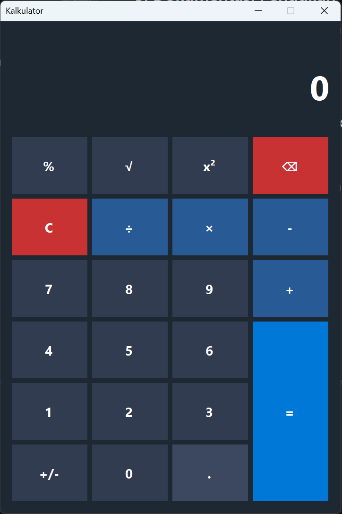
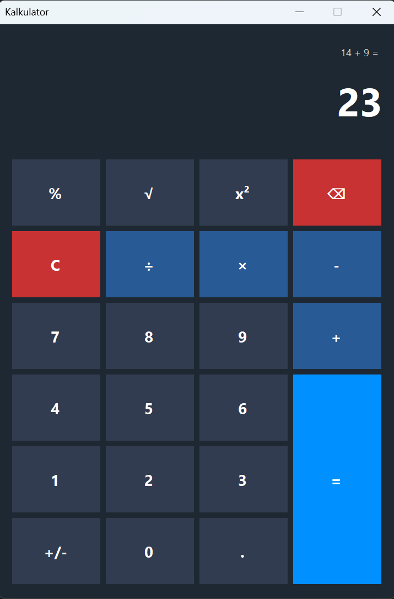
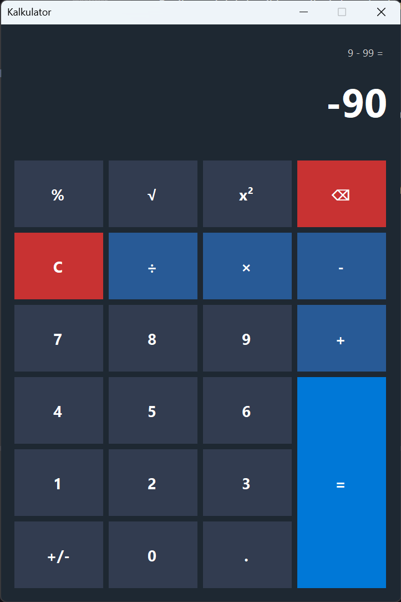
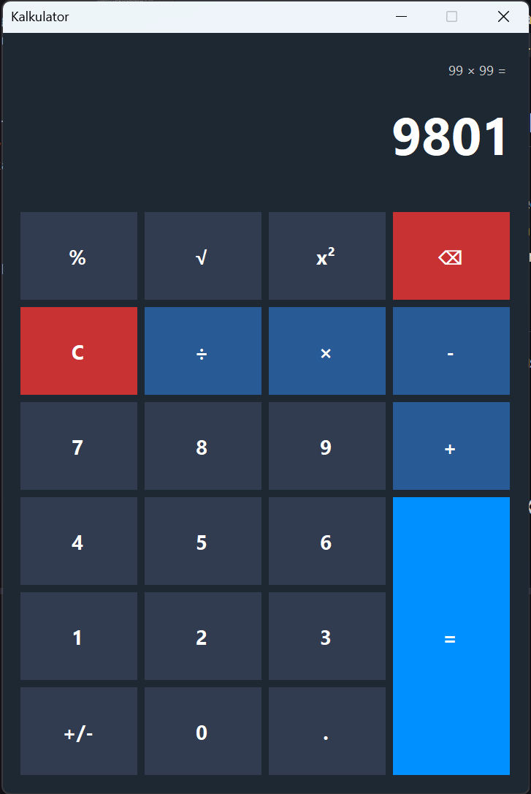
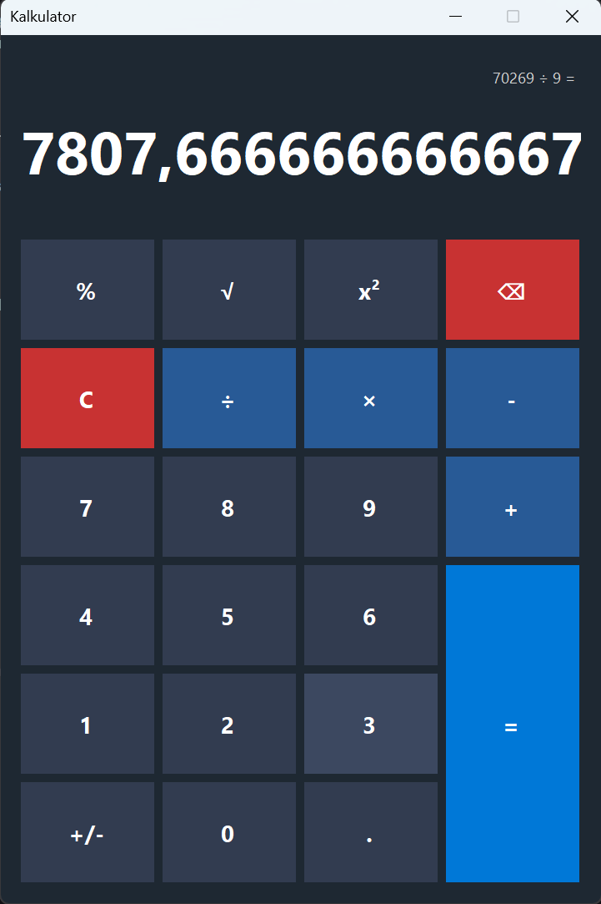
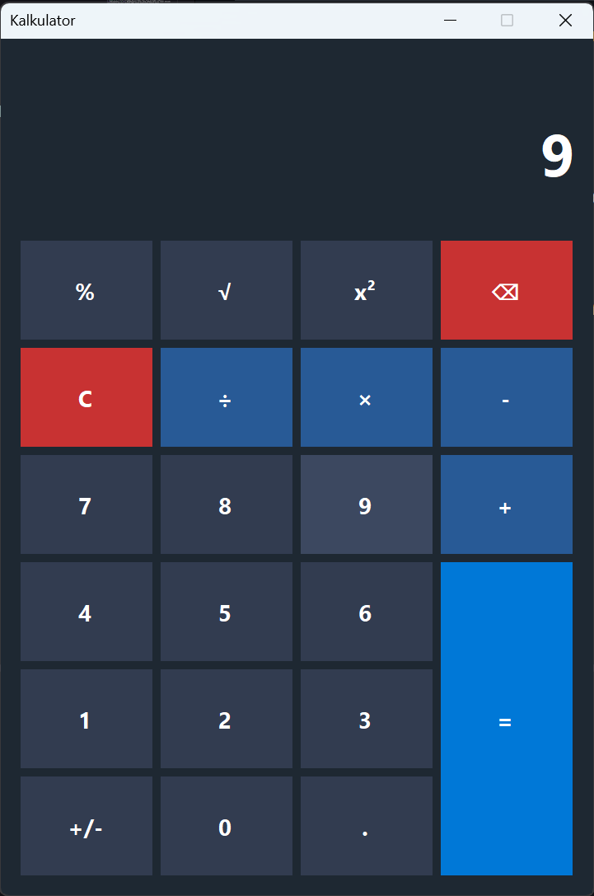
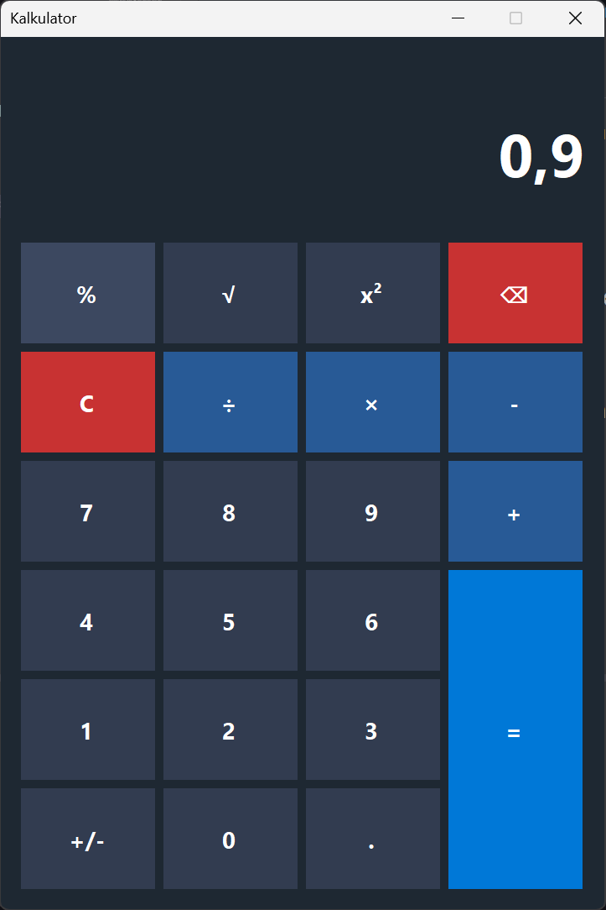

# Week 03 - Membuat Aplikasi Kalkulator Sederhana

**Nama**: Hosea Felix Sanjaya  
**NRP**: 5025241177  
**Kelas**: PBKK D

## 1. Tujuan
Membuat kalkulator desktop dengan Windows Forms di .NET. Tiap tombol punya event handler sendiri, tampilan diatur lewat kode, dan kalkulator mendukung operasi dasar serta kuadrat, akar, persen, dan ganti tanda.

## 2. Struktur Project

```
Week-03/
├── README.md
├── image*.png
└── src/
    ├── Kalkulator.csproj
    ├── Program.cs
    ├── Form1.cs
    └── Form1.Designer.cs
```

## 3. Penjelasan Kode

### `Kalkulator.csproj`
Target `net8.0-windows` dengan `UseWindowsForms` aktif. `EnableWindowsTargeting` membuat project tetap bisa di-build dari Linux, tapi aplikasinya hanya bisa dijalankan di Windows.

### `Program.cs`

* `[STAThread]` wajib ada di aplikasi Windows Forms supaya komponen UI berjalan di satu thread.
* `ApplicationConfiguration.Initialize()` memakai gaya visual bawaan Windows.
* `Application.Run(new Form1())` membuka form utama dan menjaga program tetap berjalan sampai jendelanya ditutup.

### `Form1.cs`

* **Tema (`ApplyBlueTheme`)**: dipanggil sekali di konstruktor. Fungsi ini melewati semua kontrol di form dan mengatur warna berdasarkan jenisnya: `=` biru, `C` dan `⌫` merah, operator biru tua, angka abu-abu. Jadi warna tidak perlu diatur satu per satu di designer.
* **Kuadrat dan akar**: memakai `Math.Pow` dan `Math.Sqrt`. Akar dari bilangan negatif ditolak dengan pesan error.
* **Persen**: angka di layar dibagi 100.
* **`+/-`**: menambah atau menghapus tanda `-` di depan teks angka.
* **Penanganan error**: tombol `=` dibungkus `try-catch`. Pembagian dengan nol melempar `DivideByZeroException`, lalu pesannya ditampilkan lewat `MessageBox`, jadi aplikasi tidak crash.

### `Form1.Designer.cs`
Dibuat otomatis oleh designer Visual Studio. Isinya posisi tombol, layar, dan label riwayat operasi.

## 4. Cara Menjalankan
Hanya bisa dijalankan di Windows.

```bash
cd Week-03/src
dotnet run
```

## 5. Dokumentasi

### Tampilan Awal


### Melakukan Penambahan


### Melakukan Pengurangan


### Melakukan Perkalian


### Melakukan Pembagian


### Melakukan Akar


### Melakukan Persen

