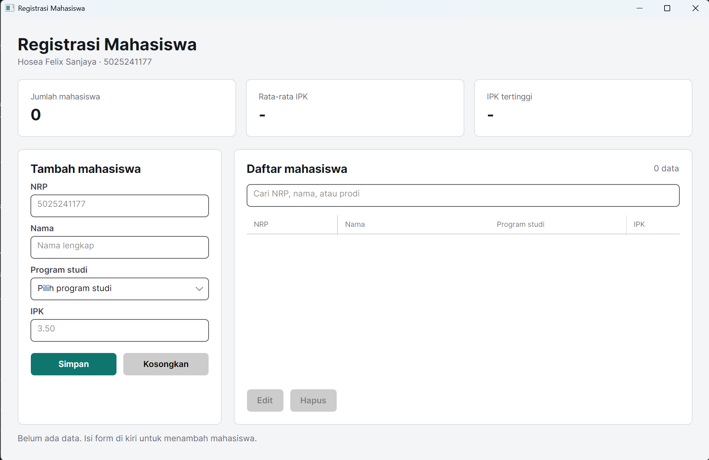
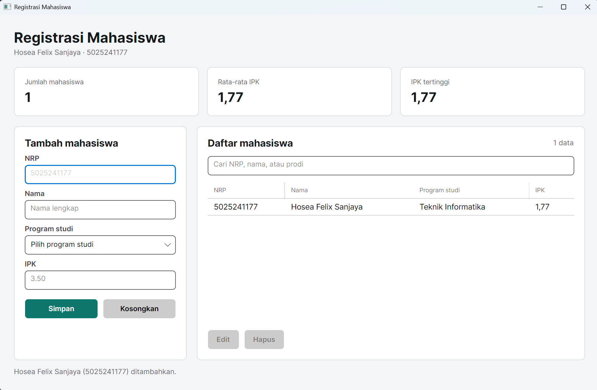
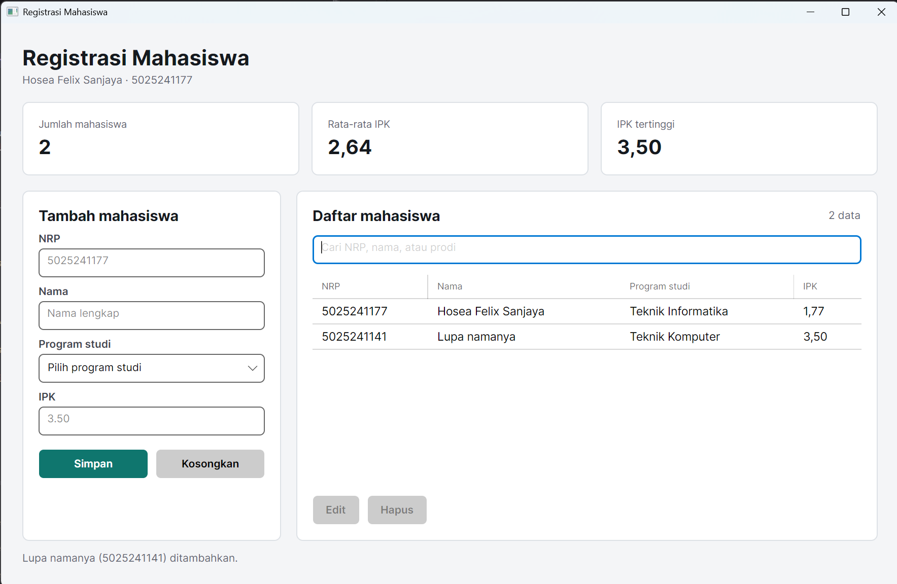
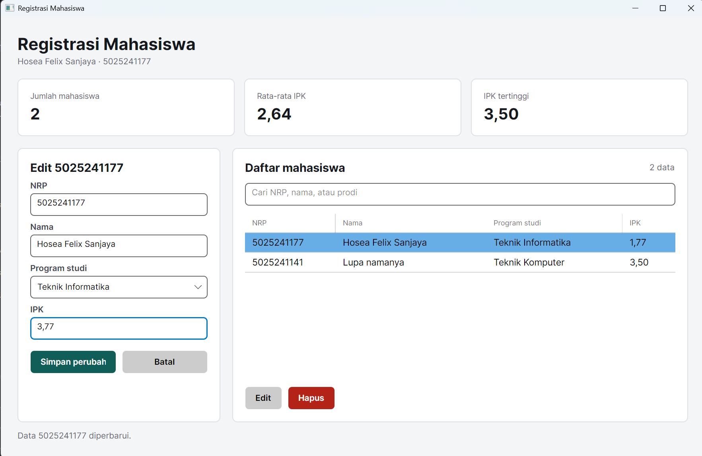
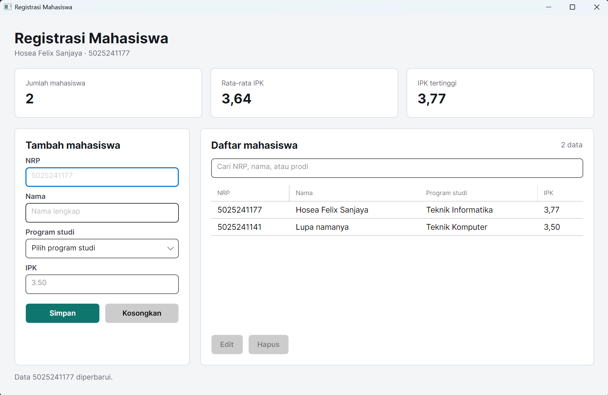
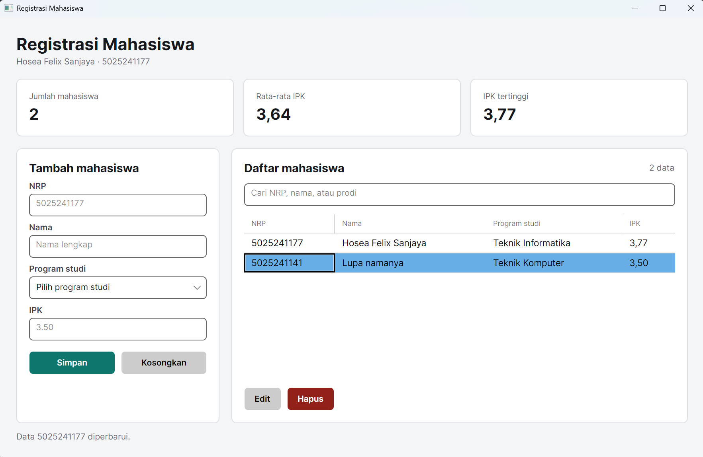
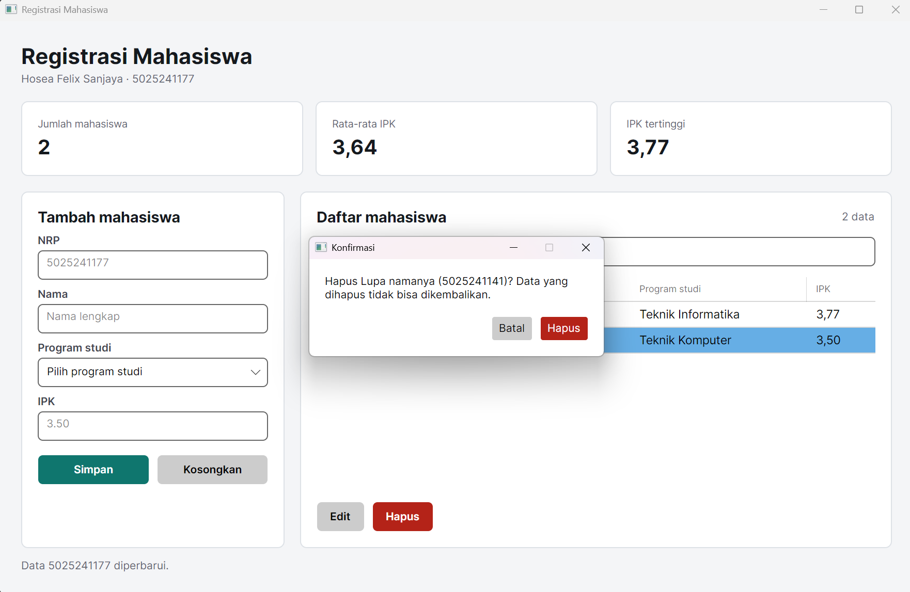
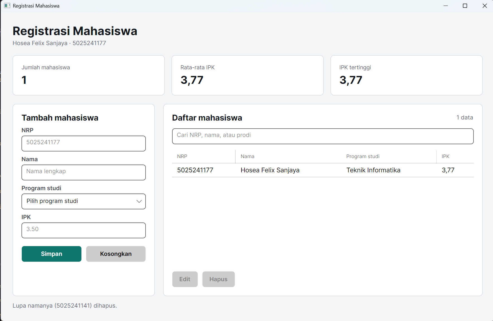

# Week 04 - Aplikasi Desktop Registrasi Mahasiswa (Avalonia)

**Nama**: Hosea Felix Sanjaya  
**NRP**: 5025241177  
**Kelas**: PBKK D

## 1. Tujuan
Membuat aplikasi desktop dengan C# dan Avalonia UI untuk mengelola data mahasiswa (NRP, nama, program studi, IPK). Avalonia dipakai karena, tidak seperti Windows Forms di Week 03, aplikasinya bisa jalan di Linux juga.

Fitur:
* Tambah, edit, dan hapus data mahasiswa. Hapus selalu minta konfirmasi dulu.
* Tabel data dengan `DataGrid`, bisa diurutkan per kolom.
* Pencarian langsung berdasarkan NRP, nama, atau prodi.
* Validasi input: NRP 10 digit dan tidak boleh dobel, nama wajib, prodi wajib, IPK 0 sampai 4.
* Ringkasan jumlah mahasiswa, rata-rata IPK, dan IPK tertinggi.

## 2. Struktur Project

```
Week-04/
├── README.md
├── img/
└── StudentRegistrationApp/
    ├── StudentRegistrationApp.csproj
    ├── Program.cs
    ├── App.axaml
    ├── App.axaml.cs
    ├── Mahasiswa.cs
    ├── MainWindow.axaml
    └── MainWindow.axaml.cs
```

## 3. Penjelasan Kode

### `StudentRegistrationApp.csproj`
Target `net8.0` dengan paket Avalonia 11. `DataGrid` ada di paket terpisah (`Avalonia.Controls.DataGrid`), jadi perlu ditambahkan sendiri. `AvaloniaUseCompiledBindingsByDefault` dimatikan supaya `{Binding NRP}` di kolom tabel bisa dipakai tanpa `x:DataType`.

### `Program.cs`
Entry point. `UsePlatformDetect()` memilih backend sesuai OS, `WithInterFont()` memakai font Inter, lalu `StartWithClassicDesktopLifetime` membuka aplikasi.

### `App.axaml` dan `App.axaml.cs`
`RequestedThemeVariant="Light"` memaksa tema terang supaya warna tetap sama walaupun OS memakai dark mode. `StyleInclude` memuat style Fluent untuk `DataGrid`. `App.axaml.cs` menjadikan `MainWindow` sebagai jendela utama.

### `Mahasiswa.cs`
Model data dengan properti `NRP`, `Nama`, `Prodi`, dan `IPK`. `IPKText` menampilkan IPK dengan dua angka di belakang koma di tabel, sedangkan pengurutan kolom IPK tetap memakai nilai angkanya (`SortMemberPath="IPK"`).

### `MainWindow.axaml`
Layout dibagi empat baris: judul, tiga kartu ringkasan, isi (form di kiri, tabel di kanan), dan baris status di bawah. Style di `Window.Styles` dipakai ulang lewat class, misalnya `Border.panel` untuk semua kartu dan `Button.primary` / `Button.danger` untuk warna tombol.

### `MainWindow.axaml.cs`

* **Simpan (`BtnSimpan_Click`)**: dipakai untuk tambah sekaligus edit. Kalau `sedangDiedit` kosong, data baru ditambahkan. Kalau tidak, data yang sedang diedit yang diubah.
* **Validasi (`Validasi`)**: mengembalikan pesan error pertama yang ditemukan, atau `null` kalau semua input benar. Pesan error tampil di bawah form, bukan di popup. Pengecekan NRP dobel melewati mahasiswa yang sedang diedit, jadi menyimpan tanpa mengubah NRP tidak dianggap duplikat. Koma di IPK diganti titik dulu, jadi `3,5` dan `3.5` sama-sama diterima.
* **Edit (`MulaiEdit`)**: bisa dari tombol Edit atau double-click baris tabel. Data baris yang dipilih dimasukkan ke form dan judul form berubah jadi "Edit &lt;NRP&gt;".
* **Hapus (`BtnHapus_Click`)**: membuka dialog `Konfirmasi` dulu. Dialog ini dibuat lewat kode dan mengembalikan `true` hanya kalau tombol Hapus ditekan.
* **Tombol Edit dan Hapus** baru aktif setelah ada baris yang dipilih (`GridMahasiswa_SelectionChanged`).
* **Tampil dan cari (`TampilkanData`)**: memfilter list dengan LINQ `Where` berdasarkan kata kunci, lalu menghitung ulang ringkasan dengan `Count`, `Average`, dan `Max`. Dipanggil setiap data berubah atau teks pencarian diketik.

## 4. Cara Menjalankan

```bash
cd Week-04/StudentRegistrationApp
dotnet restore
dotnet run
```

`dotnet restore` mengunduh paket Avalonia dari NuGet. `dotnet run` otomatis build dulu sebelum menjalankan aplikasi.

## 5. Dokumentasi

### Tampilan Awal


### Menambah Data Mahasiswa


<br>



### Mencari Data Mahasiswa


### Mengedit Data Mahasiswa


<br>



### Menghapus Data Mahasiswa


<br>



<br>


