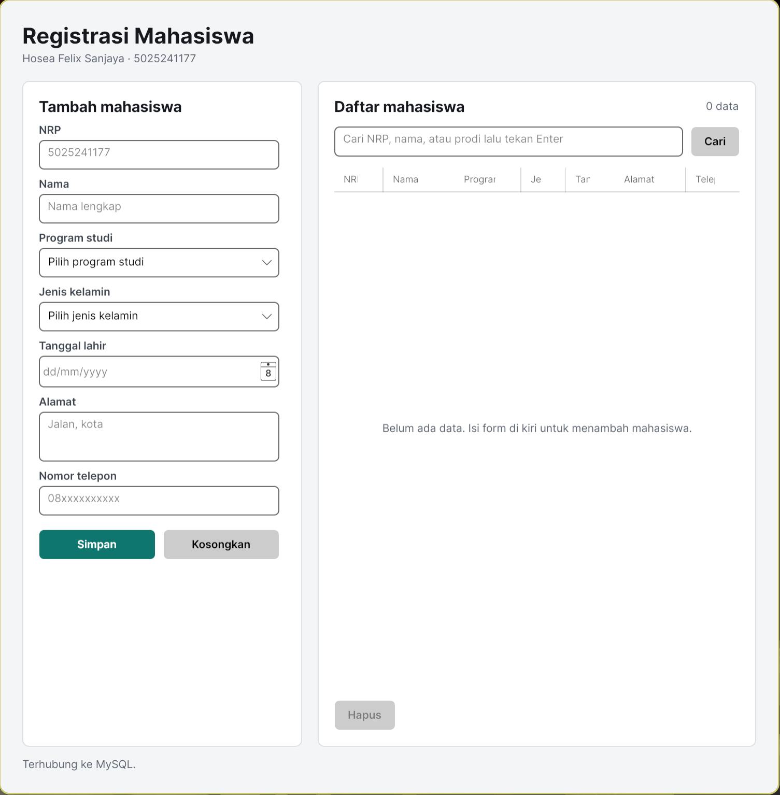
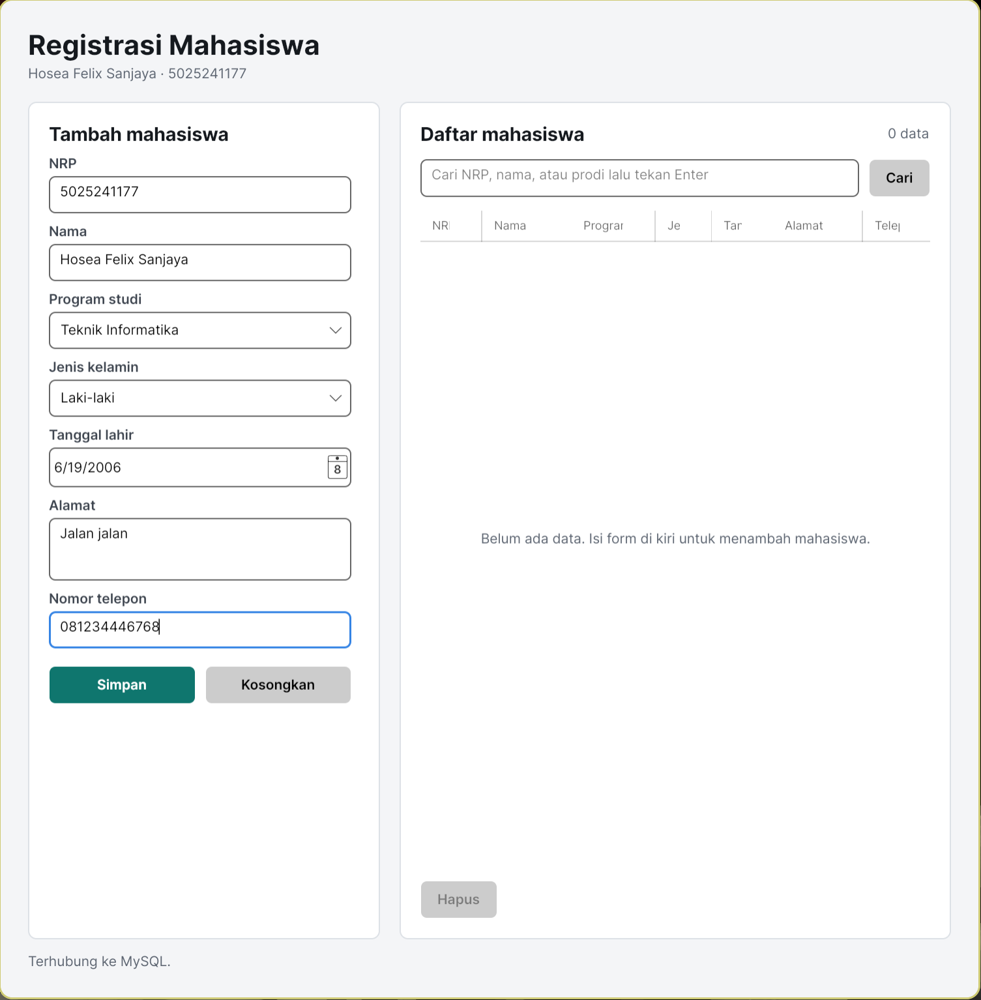
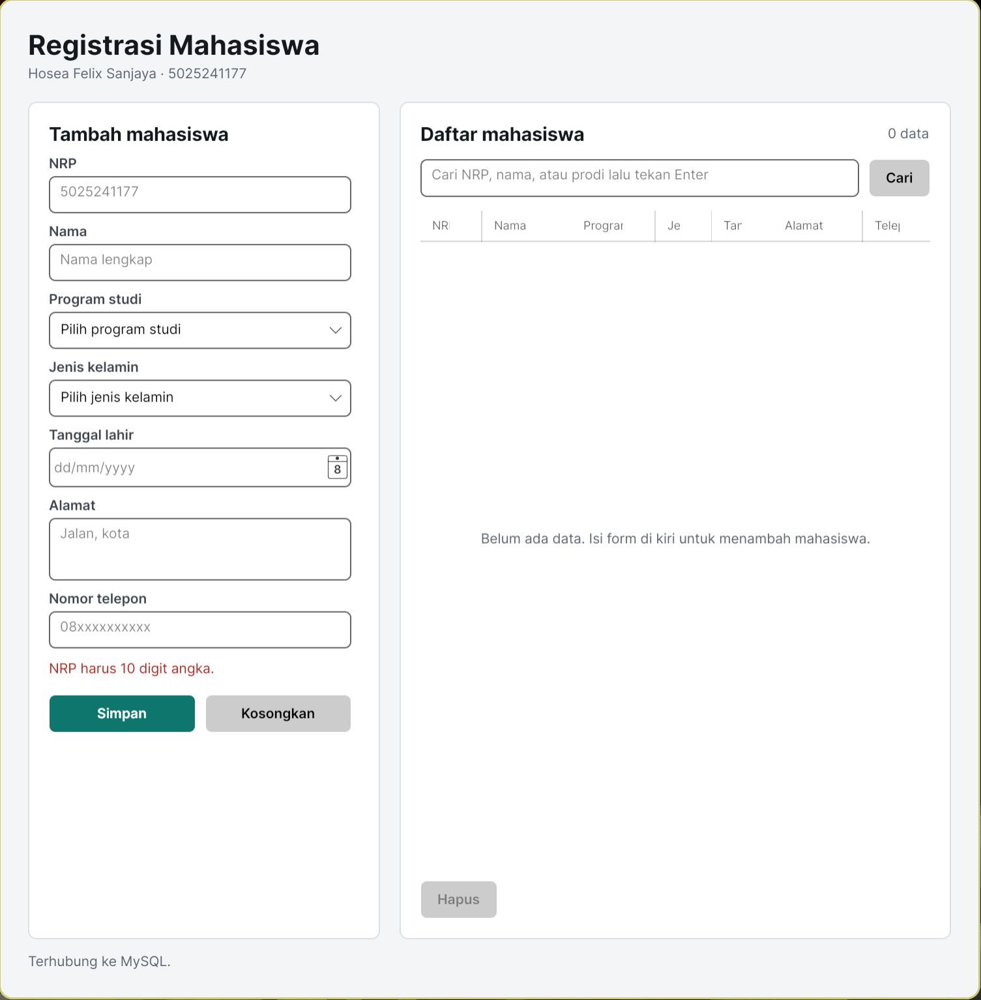
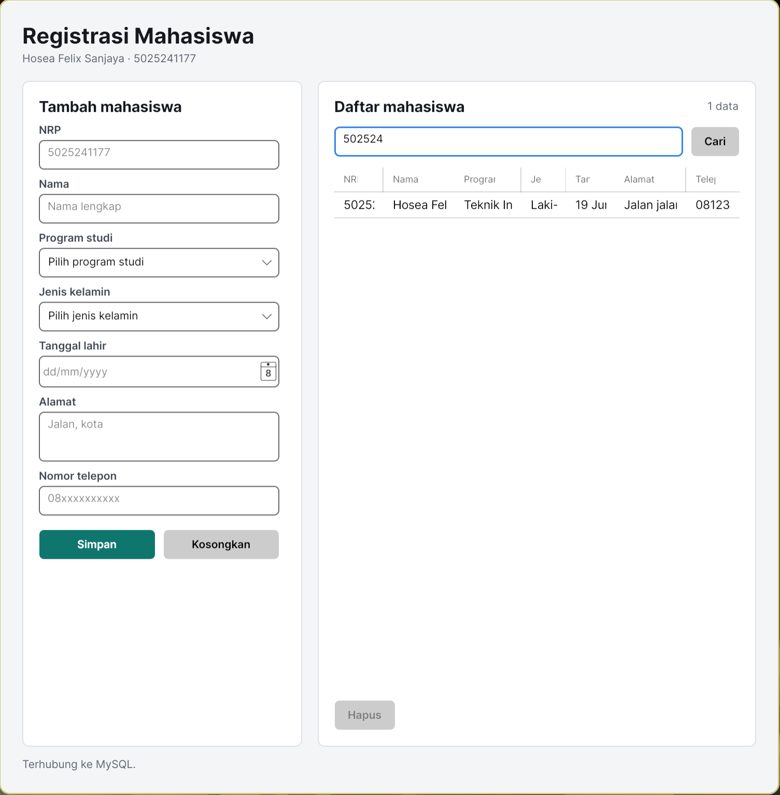
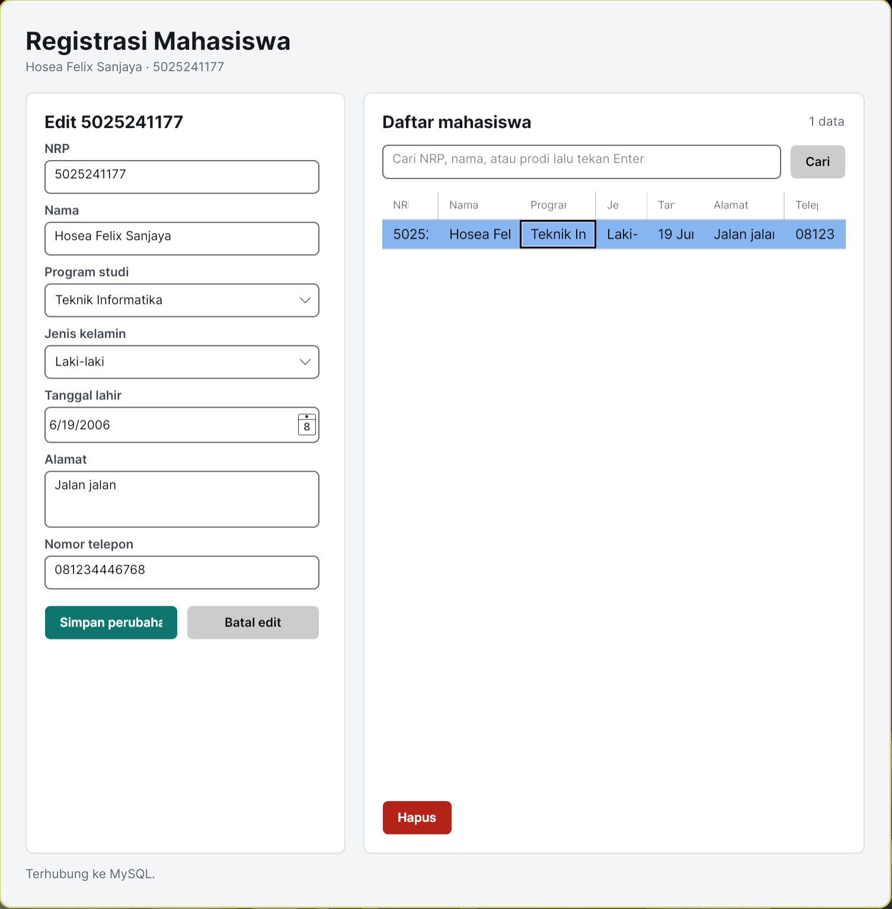
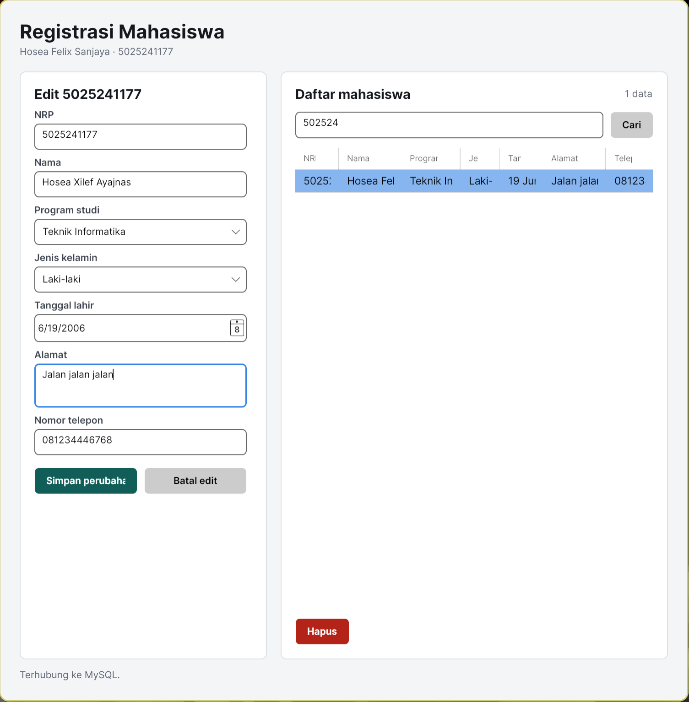
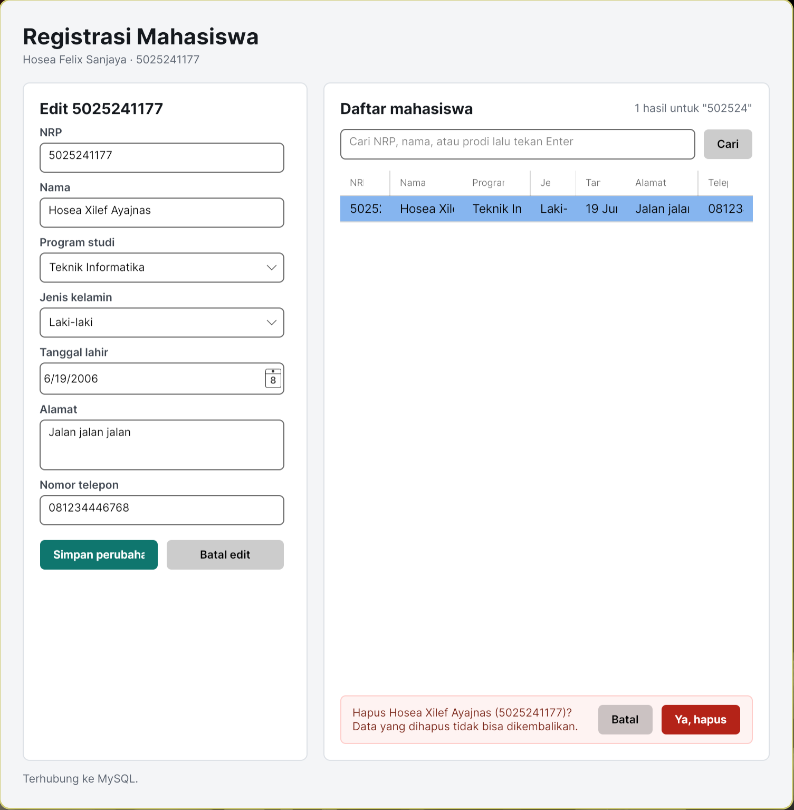

# Week 05 - Registrasi Mahasiswa dengan MVVM dan MySQL

**Nama**: Hosea Felix Sanjaya  
**NRP**: 5025241177  
**Kelas**: PBKK D

## 1. Tujuan
Melanjutkan aplikasi registrasi mahasiswa dari Week 04 dengan dua perubahan besar:

1. **Pola MVVM (Model-View-ViewModel).** Di Week 04 semua logika ada di `MainWindow.axaml.cs`. Sekarang View hanya berisi tampilan dan binding, logika pindah ke ViewModel, dan akses database dipisah ke repository.
2. **Data disimpan di MySQL.** Di Week 04 data hanya ada di `List` dan hilang saat aplikasi ditutup. Sekarang data disimpan ke tabel `mahasiswa` lewat paket `MySqlConnector`.

Aplikasi tetap memakai Avalonia supaya bisa jalan di Linux.

Fitur:
* Tambah, edit, dan hapus data mahasiswa. Hapus minta konfirmasi dulu.
* Data mahasiswa: NRP, nama, program studi, jenis kelamin, tanggal lahir, alamat, dan nomor telepon.
* Pencarian berdasarkan NRP, nama, atau prodi (query `LIKE` ke MySQL).
* Validasi input sebelum disimpan, termasuk cek NRP dobel ke database.
* Pesan yang jelas saat data sedang dimuat, saat tabel kosong, dan saat MySQL tidak bisa diakses.

## 2. Struktur Project

```
Week-05/
├── README.md
├── img/
└── StudentRegistrationMVVM/
    ├── StudentRegistrationMVVM.csproj
    ├── Program.cs
    ├── App.axaml
    ├── App.axaml.cs
    ├── schema.sql
    ├── docker-compose.yml
    ├── Models/
    │   └── Mahasiswa.cs
    ├── Data/
    │   └── MahasiswaRepository.cs
    ├── ViewModels/
    │   ├── ViewModelBase.cs
    │   ├── RelayCommand.cs
    │   └── MainWindowViewModel.cs
    └── Views/
        ├── MainWindow.axaml
        └── MainWindow.axaml.cs
```

## 3. Penjelasan Kode

### Pembagian MVVM

| Lapisan | File | Tugas |
| :-- | :-- | :-- |
| Model | `Models/Mahasiswa.cs` | Bentuk data satu mahasiswa |
| View | `Views/MainWindow.axaml` | Tampilan, semua isinya terhubung lewat binding |
| ViewModel | `ViewModels/MainWindowViewModel.cs` | State form, daftar data, validasi, dan command |
| Data | `Data/MahasiswaRepository.cs` | Query ke MySQL |

### `StudentRegistrationMVVM.csproj`
Sama seperti Week 04 (Avalonia 11, `net8.0`), ditambah paket `MySqlConnector` untuk koneksi ke MySQL.

### `App.axaml.cs`
Tempat semua bagian dirangkai: membuat `MahasiswaRepository`, memberikannya ke `MainWindowViewModel`, lalu menjadikan ViewModel itu `DataContext` dari `MainWindow`. Setelah itu `MuatCommand` dijalankan sekali untuk mengambil data awal.

### `Models/Mahasiswa.cs`
Properti sesuai kolom tabel: `Id`, `Nrp`, `Nama`, `Prodi`, `JenisKelamin`, `TanggalLahir`, `Alamat`, `NoTelepon`. `TanggalLahirText` menampilkan tanggal dengan format Indonesia (misalnya `17 Agu 2005`) di tabel, sedangkan pengurutan kolom tetap memakai nilai tanggalnya (`SortMemberPath="TanggalLahir"`).

### `Data/MahasiswaRepository.cs`
Semua akses database ada di sini, jadi ViewModel tidak pernah menulis SQL.

* `GetAllAsync(kataKunci)`: mengambil semua data, atau hanya yang NRP, nama, atau prodinya cocok dengan kata kunci. Karakter `%` dan `_` di-escape dulu supaya tidak dianggap wildcard oleh `LIKE`.
* `InsertAsync`, `UpdateAsync`, `DeleteAsync`: tambah, ubah, dan hapus data. Parameter yang sama untuk insert dan update diisi lewat `TambahParameter` supaya tidak ditulis dua kali.
* `NrpExistsAsync(nrp, kecualiId)`: cek NRP dobel. Saat edit, baris milik mahasiswa itu sendiri dilewati.
* Semua query memakai parameter (`@nrp`, `@nama`, dan seterusnya), bukan menggabungkan string input ke SQL, jadi aman dari SQL injection.
* Semua method `async`, jadi tampilan tidak membeku saat menunggu MySQL.

Connection string diambil dari environment variable `STUDENT_DB_CONNECTION_STRING`. Kalau tidak ada, dipakai default:

```
Server=localhost;Port=3306;Database=student_db;User ID=root;Password=;Connection Timeout=5;
```

`Connection Timeout=5` membuat aplikasi langsung menampilkan pesan error setelah 5 detik kalau MySQL mati, bukan menunggu 15 detik (bawaan MySqlConnector).

### `ViewModels/ViewModelBase.cs`
Implementasi `INotifyPropertyChanged`. Method `SetProperty` mengubah nilai field lalu memberi tahu View bahwa properti itu berubah, sehingga tampilan ikut ter-update tanpa perlu mengubah kontrol secara manual seperti di Week 04.

### `ViewModels/RelayCommand.cs`
Tombol di View tidak memakai event `Click`, tapi `Command` yang di-binding ke ViewModel.

* `RelayCommand`: untuk aksi biasa, misalnya mengosongkan form.
* `AsyncRelayCommand`: untuk aksi yang menunggu database. Selama aksi berjalan, `CanExecute` bernilai `false` sehingga tombolnya nonaktif dan tidak bisa diklik dua kali.

### `ViewModels/MainWindowViewModel.cs`

* **Form**: setiap input punya properti sendiri (`Nrp`, `Nama`, `Prodi`, dan seterusnya) yang di-binding dua arah ke View.
* **Daftar data**: `DaftarMahasiswa` berupa `ObservableCollection`, jadi `DataGrid` otomatis ikut berubah saat isinya diganti.
* **Pilih baris (`SelectedMahasiswa`)**: data baris yang dipilih disalin ke form dan form berubah ke mode edit. Karena disalin, mengetik di form tidak langsung mengubah tabel sebelum tombol Simpan ditekan.
* **Simpan (`SimpanAsync`)**: dipakai untuk tambah sekaligus edit. Data divalidasi, NRP dicek ke database, lalu `InsertAsync` atau `UpdateAsync` dipanggil. Kalau dua orang menyimpan NRP yang sama hampir bersamaan, constraint `UNIQUE` di MySQL tetap menolaknya dan error itu ditangkap (`MySqlErrorCode.DuplicateKeyEntry`).
* **Validasi (`Validasi`)**: mengembalikan objek `Mahasiswa` yang sudah dirapikan, atau `null` dan mengisi `PesanForm` kalau ada yang salah. Aturannya:
  * NRP 10 digit angka.
  * Nama minimal 3 karakter. Spasi berlebih dirapikan.
  * Program studi dan jenis kelamin wajib dipilih.
  * Tanggal lahir wajib diisi dan umur minimal 15 tahun.
  * Alamat minimal 5 karakter.
  * Nomor telepon diawali `08` atau `62`, 10 sampai 14 digit. Spasi, strip, dan `+` dibuang dulu, jadi `+62 812-3456-7890` tetap diterima dan disimpan sebagai `6281234567890`.
* **Hapus**: `HapusCommand` hanya aktif kalau ada baris yang dipilih. Menekannya tidak langsung menghapus, tapi memunculkan konfirmasi di bawah tabel. Data baru dihapus setelah tombol "Ya, hapus" (`KonfirmasiHapusCommand`) ditekan. Konfirmasi dibuat di dalam window, bukan dialog terpisah, supaya ViewModel tidak perlu tahu apa-apa soal window.
* **Cari (`MuatCommand`)**: menjalankan `GetAllAsync` dengan isi kolom cari. Bisa lewat tombol Cari atau tekan Enter. Kolom cari kosong berarti tampilkan semua data.
* **Kondisi tabel kosong**: `InfoTabel` memilih satu dari empat pesan: sedang memuat, gagal terhubung (ada tombol "Coba lagi"), tidak ada hasil pencarian, atau belum ada data sama sekali.

### `Views/MainWindow.axaml` dan `MainWindow.axaml.cs`
Layout dan style sama dengan Week 04: form di kiri, tabel di kanan, baris status di bawah. Bedanya, tidak ada `x:Name` dan tidak ada event handler. Semua kontrol terhubung ke ViewModel lewat `{Binding ...}` dan `Command="{Binding ...}"`. Akibatnya `MainWindow.axaml.cs` hanya berisi `InitializeComponent()`.

Baris status di bawah menampilkan hasil aksi terakhir. Teksnya berubah merah lewat `Classes.error="{Binding IsError}"` kalau MySQL gagal diakses, dan `ProgressBar` muncul selama query berjalan.

### `schema.sql`
Membuat database `student_db` dan tabel `mahasiswa`. Kolom `id` memakai `AUTO_INCREMENT`, kolom `nrp` diberi constraint `UNIQUE`.

| Kolom | Tipe | Keterangan |
| :-- | :-- | :-- |
| `id` | `INT` | Primary key, otomatis |
| `nrp` | `CHAR(10)` | Wajib dan unik |
| `nama` | `VARCHAR(100)` | |
| `prodi` | `VARCHAR(50)` | |
| `jenis_kelamin` | `VARCHAR(20)` | |
| `tanggal_lahir` | `DATE` | |
| `alamat` | `VARCHAR(255)` | |
| `no_telepon` | `VARCHAR(20)` | |

### Alur Data

```
User klik tombol / pilih baris di View
        │  (Command / Binding)
        ▼
MainWindowViewModel: validasi dan rapikan input
        │
        ▼
MahasiswaRepository: query ke MySQL
        │
        ▼
MainWindowViewModel: isi ulang DaftarMahasiswa
        │  (ObservableCollection + PropertyChanged)
        ▼
DataGrid dan baris status di View ikut ter-update
```

## 4. Cara Menjalankan

### Menyiapkan MySQL

Pilih salah satu:

**a. Lewat Docker.** `docker-compose.yml` menjalankan MySQL 8.4 dengan user `root` tanpa password, dan `schema.sql` otomatis dijalankan saat container pertama kali dibuat.

```bash
cd Week-05/StudentRegistrationMVVM
docker compose up -d
```

**b. MySQL yang sudah terpasang.** Jalankan `schema.sql`:

```bash
mysql -u root -p < Week-05/StudentRegistrationMVVM/schema.sql
```

Kalau user atau password-nya bukan `root` tanpa password, set connection string sebelum menjalankan aplikasi:

```bash
export STUDENT_DB_CONNECTION_STRING="Server=localhost;Port=3306;Database=student_db;User ID=root;Password=passwordmu;"
```

### Menjalankan Aplikasi

```bash
cd Week-05/StudentRegistrationMVVM
dotnet restore
dotnet run
```

Kalau MySQL belum jalan, aplikasi tetap terbuka dan menampilkan pesan error di tabel dan baris status. Setelah MySQL jalan, klik "Coba lagi".

## 5. Dokumentasi

### Tampilan Awal


### Menambah Data Mahasiswa


<br>


### Validasi Input


### Mencari Data Mahasiswa


### Mengedit Data Mahasiswa


<br>



<br>


### Menghapus Data Mahasiswa


<br>


