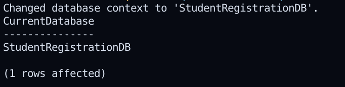
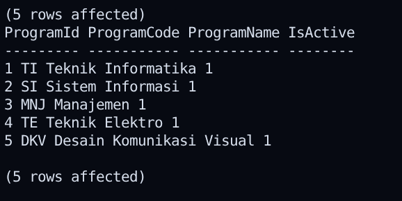
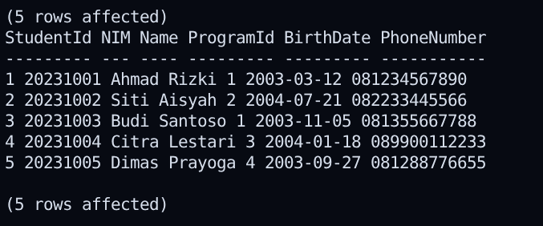
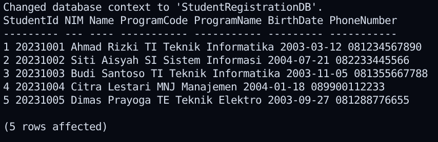
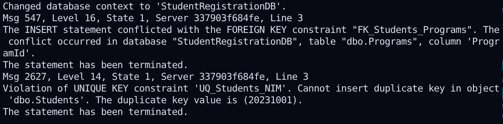
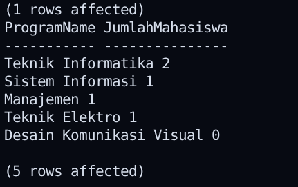
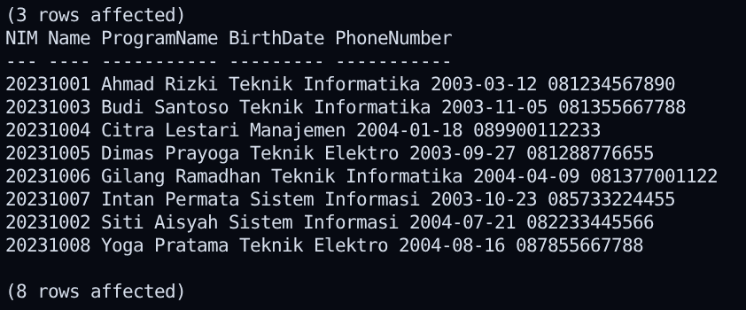
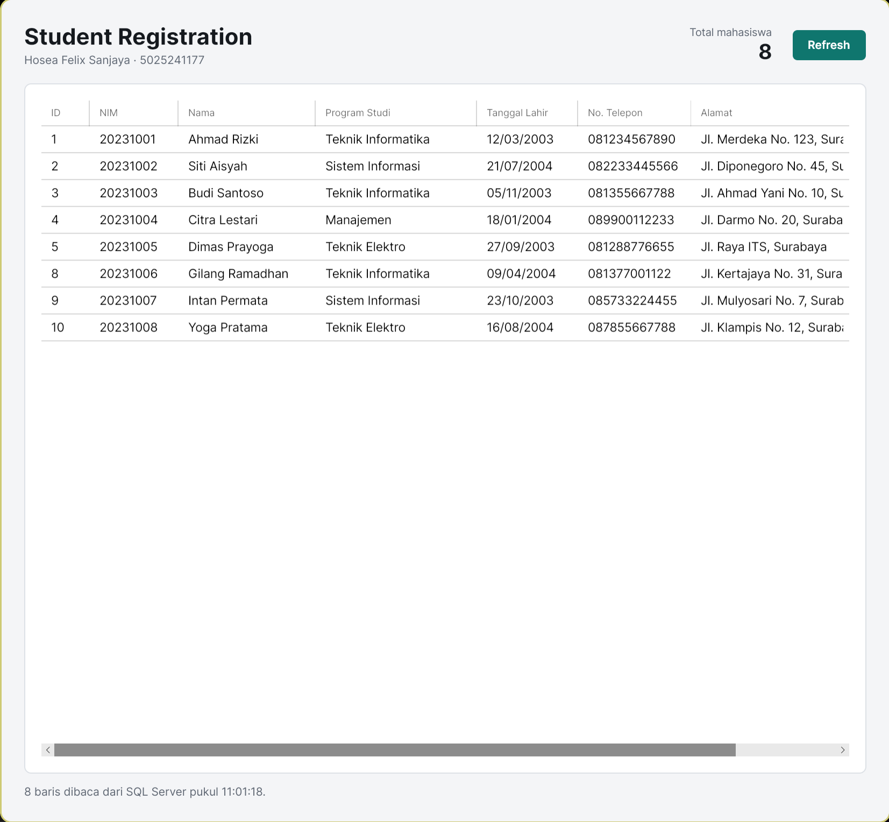
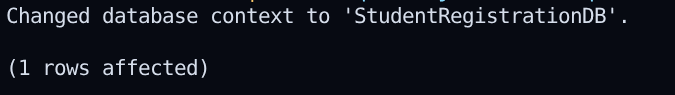
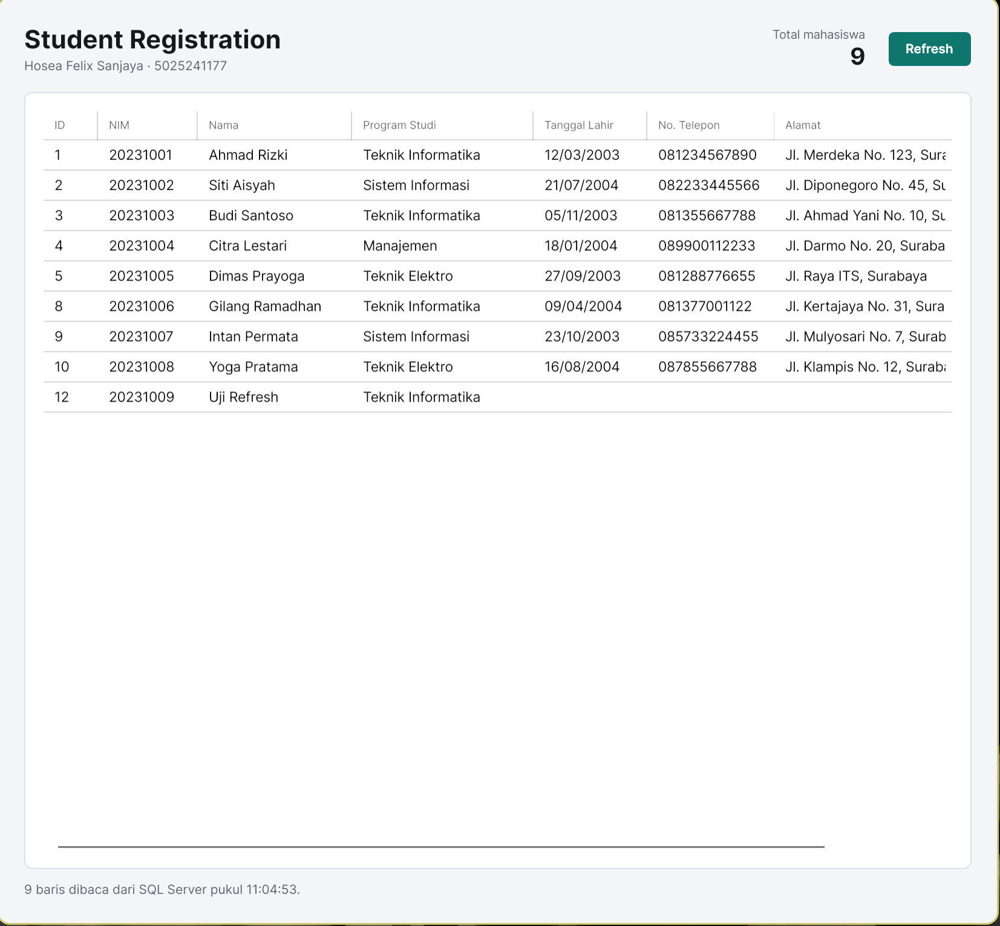

# Week 06 - Database SQL Server dan Aplikasi Desktop dengan ADO.NET

**Nama**: Hosea Felix Sanjaya  
**NRP**: 5025241177  
**Kelas**: PBKK D

## 1. Tujuan
Dua praktikum yang saling menyambung:

1. **Database.** Membuat database `StudentRegistrationDB` di SQL Server dengan tabel `Programs` dan `Students`, menghubungkan keduanya dengan relasi one-to-many, lalu menjalankan query `SELECT`, `JOIN`, `WHERE`, `COUNT`, dan `GROUP BY`.
2. **Aplikasi.** Membuat aplikasi desktop C# yang membaca data dari database itu memakai ADO.NET (`SqlConnection`, `SqlCommand`, `SqlDataReader`) dan menampilkannya di `DataGrid`.

Modul praktikum memakai Windows, SSMS, dan WPF. Karena saya memakai Linux, ada tiga penyesuaian:

| Modul | Yang saya pakai | Alasan |
| :-- | :-- | :-- |
| SQL Server Express di Windows | SQL Server 2022 di container Docker | SQL Server punya image resmi untuk Linux |
| SSMS | `sqlcmd` di dalam container | SSMS hanya ada di Windows |
| Windows Authentication | SQL Authentication (user `sa`) | Windows Authentication tidak tersedia di Linux |
| WPF | Avalonia, sama seperti Week 04 dan 05 | WPF hanya jalan di Windows |

Kode ADO.NET-nya tetap sama dengan modul, karena `Microsoft.Data.SqlClient` jalan di Linux.

## 2. Struktur Project

```
Week-06/
├── README.md
├── img/
├── sql/
│   ├── 01-database.sql
│   ├── 02-programs.sql
│   ├── 03-students.sql
│   ├── 04-join.sql
│   ├── 05-uji-integritas.sql
│   ├── 06-query-challenge.sql
│   ├── 07-mini-assignment.sql
│   └── 08-uji-refresh.sql
└── StudentRegistration/
    ├── StudentRegistration.csproj
    ├── Program.cs
    ├── App.axaml
    ├── App.axaml.cs
    ├── MainWindow.axaml
    ├── MainWindow.axaml.cs
    ├── Models/
    │   ├── Student.cs
    │   └── StudyProgram.cs
    └── Repositories/
        └── StudentRepository.cs
```

Setiap langkah praktikum database ada di file `.sql` sendiri, jadi bisa dijalankan dan di-screenshot satu per satu.

## 3. Penjelasan Kode: Database

### Rancangan Tabel

Satu program studi punya banyak mahasiswa, satu mahasiswa hanya punya satu program studi. Jadi relasinya one-to-many, dihubungkan lewat kolom `ProgramId`.

| Tabel | Kolom | Kunci |
| :-- | :-- | :-- |
| `Programs` | `ProgramId`, `ProgramCode`, `ProgramName`, `IsActive`, `CreatedAt` | `ProgramId` PRIMARY KEY, `ProgramCode` UNIQUE |
| `Students` | `StudentId`, `NIM`, `Name`, `ProgramId`, `BirthDate`, `Address`, `PhoneNumber`, `CreatedAt`, `UpdatedAt` | `StudentId` PRIMARY KEY, `NIM` UNIQUE, `ProgramId` FOREIGN KEY ke `Programs` |

```
Programs (1) ──────< Students (N)
ProgramId            ProgramId
```

### `01-database.sql`
Membuat database `StudentRegistrationDB`. Pengecekan `IF DB_ID(...) IS NULL` membuat script aman dijalankan ulang. `SELECT DB_NAME()` memastikan database yang aktif sudah benar.

### `02-programs.sql`
Membuat tabel `Programs` lalu mengisi lima program studi.

* `IDENTITY(1,1)`: `ProgramId` terisi otomatis mulai dari 1.
* `UNIQUE` pada `ProgramCode`: kode prodi tidak boleh kembar.
* `DEFAULT 1` pada `IsActive` dan `DEFAULT SYSDATETIME()` pada `CreatedAt`: kolom ini terisi sendiri kalau tidak disebut di `INSERT`.

Setiap constraint diberi nama (`PK_Programs`, `UQ_Programs_ProgramCode`, dan seterusnya), jadi pesan error dari SQL Server langsung menyebut constraint mana yang dilanggar.

### `03-students.sql`
Membuat tabel `Students` dan mengisi lima mahasiswa contoh dari modul.

* `NIM` diberi `UNIQUE`.
* `ProgramId` diberi FOREIGN KEY `FK_Students_Programs` yang merujuk ke `Programs(ProgramId)`.
* `BirthDate`, `Address`, `PhoneNumber`, dan `UpdatedAt` boleh `NULL`.

### `04-join.sql`
`Students` hanya menyimpan `ProgramId`, jadi nama prodi diambil dengan `INNER JOIN` ke `Programs`. Query ini juga dipakai aplikasi.

### `05-uji-integritas.sql`
Dua `INSERT` yang memang harus gagal:

| Uji | Data | Hasil yang diharapkan |
| :-- | :-- | :-- |
| FOREIGN KEY | `ProgramId = 99`, tidak ada di `Programs` | Msg 547, konflik dengan `FK_Students_Programs` |
| UNIQUE | `NIM = 20231001`, sudah dipakai | Msg 2627, pelanggaran `UQ_Students_NIM` |

Kedua batch dipisah `GO`, jadi kegagalan pertama tidak menghentikan uji kedua. Penolakan ini datang dari SQL Server sendiri, jadi data tetap terjaga walaupun aplikasinya lupa memvalidasi.

### `06-query-challenge.sql`
* Mahasiswa Teknik Informatika: `JOIN` + `WHERE p.ProgramCode = 'TI'`.
* Total mahasiswa: `COUNT(*)`.
* Jumlah per prodi: `LEFT JOIN` + `GROUP BY`. Dipakai `LEFT JOIN` dan `COUNT(s.StudentId)`, bukan `COUNT(*)`, supaya prodi yang belum punya mahasiswa (Desain Komunikasi Visual) tetap muncul dengan angka 0.

### `07-mini-assignment.sql`
Menambah tiga mahasiswa contoh dari TI, SI, dan Teknik Elektro, lalu menampilkan semua mahasiswa dengan `JOIN` yang diurutkan berdasarkan nama.

### `08-uji-refresh.sql`
Menambah satu mahasiswa saat aplikasi sedang terbuka, untuk membuktikan tombol Refresh benar-benar membaca ulang dari database.

### Catatan: `StudentId` Melompat
Setelah lima mahasiswa awal (`StudentId` 1 sampai 5), tiga mahasiswa dari `07-mini-assignment.sql` mendapat `StudentId` 8, 9, dan 10, bukan 6, 7, dan 8. Dua `INSERT` yang ditolak di `05-uji-integritas.sql` sudah mengambil nomor 6 dan 7 dari `IDENTITY` sebelum constraint diperiksa, dan nomor yang sudah diambil tidak dikembalikan. Hal yang sama terlihat di uji Refresh. `08-uji-refresh.sql` saya jalankan dua kali: baris pertama (`StudentId` 11) dihapus supaya screenshot aplikasi sebelum Refresh menampilkan 8 mahasiswa, lalu script dijalankan lagi. Baris barunya mendapat `StudentId` 12, karena nomor 11 sudah terpakai walaupun barisnya sudah dihapus. Jadi di screenshot terakhir ada 9 mahasiswa dengan `StudentId` terbesar 12. Ini bukan kesalahan: `IDENTITY` menjamin nomor unik, bukan nomor berurutan tanpa celah. Jumlah mahasiswa tetap dihitung dari jumlah baris (`COUNT(*)`), bukan dari `StudentId` terbesar.

## 4. Penjelasan Kode: Aplikasi

### Pembagian Class

| File | Tugas |
| :-- | :-- |
| `Models/Student.cs` | Satu baris `Students`, ditambah `ProgramName` hasil `JOIN` |
| `Models/StudyProgram.cs` | Satu baris `Programs` |
| `Repositories/StudentRepository.cs` | Semua akses ke SQL Server lewat ADO.NET |
| `MainWindow.axaml` | Tampilan: total mahasiswa, tombol Refresh, dan `DataGrid` |
| `MainWindow.axaml.cs` | Memanggil repository dan mengisi tampilan |

Kalau query atau connection string berubah, cukup `StudentRepository` yang diubah. `MainWindow` tidak perlu tahu SQL.

### `StudentRegistration.csproj`
Avalonia 11 seperti minggu sebelumnya, ditambah paket `Microsoft.Data.SqlClient` untuk ADO.NET.

### `Models/Student.cs` dan `Models/StudyProgram.cs`
Properti mengikuti kolom tabel. `BirthDate` dan `UpdatedAt` bertipe `DateTime?` karena kolomnya boleh `NULL`.

Model program studi diberi nama `StudyProgram`, bukan `Program` seperti di modul. Di Avalonia (dan WPF), sudah ada class `Program` di `Program.cs` sebagai entry point aplikasi. Nama yang sama di namespace berbeda memang masih bisa di-compile, tapi gampang tertukar saat membaca kode.

### `Repositories/StudentRepository.cs`
Tiga class ADO.NET dipakai berurutan:

1. `SqlConnection` membuka koneksi berdasarkan connection string.
2. `SqlCommand` membawa query SQL ke koneksi itu.
3. `SqlDataReader` membaca hasil query baris demi baris.

* **`GetAllAsync()`**: menjalankan query `JOIN` dan mengubah setiap baris jadi objek `Student`. Posisi kolom dicari sekali dengan `GetOrdinal` sebelum loop, bukan di setiap baris. Kolom yang boleh `NULL` dicek dulu dengan `IsDBNull`, karena `GetString` pada nilai `NULL` akan melempar exception.
* **`GetTotalAsync()`**: `SELECT COUNT(*)` dengan `ExecuteScalar`, yang mengembalikan satu nilai saja.
* `using` memastikan koneksi ditutup setelah dipakai, termasuk saat terjadi error.
* Semua method `async`. Modul memakai versi sinkron, yang membuat jendela membeku selama menunggu database. Dengan `async`, jendela tetap responsif.

Connection string default:

```
Server=localhost,1433;Database=StudentRegistrationDB;User ID=sa;Password=Pbkk_Week06!;TrustServerCertificate=True;Connect Timeout=5;
```

* `localhost,1433`: container SQL Server di laptop sendiri. SQL Server memakai koma, bukan titik dua, untuk port.
* `User ID=sa;Password=...`: SQL Authentication, pengganti `Trusted_Connection=True` di modul.
* `TrustServerCertificate=True`: container memakai sertifikat self-signed, jadi tanpa ini koneksi ditolak.
* `Connect Timeout=5`: kalau SQL Server mati, pesan error muncul setelah 5 detik, bukan 15.

Password `Pbkk_Week06!` hanya untuk container lokal. Untuk server lain, isi environment variable `SQLSERVER_CONNECTION_STRING`, supaya kredensial tidak perlu ditulis di kode.

### `MainWindow.axaml`
Bagian atas berisi judul, total mahasiswa, dan tombol Refresh. Di bawahnya `DataGrid` dengan kolom yang ditulis manual (`AutoGenerateColumns="False"`). Tanggal diformat langsung di binding, misalnya `StringFormat='{}{0:dd/MM/yyyy}'`, jadi model tetap menyimpan `DateTime` dan pengurutan kolom tetap berdasarkan tanggal. Lebar kolom ditetapkan dalam pixel, kecuali `Alamat` yang mengisi sisa ruang, supaya NIM dan tanggal tidak terpotong.

### `MainWindow.axaml.cs`
* Data dimuat saat jendela terbuka (`Opened`) dan setiap kali Refresh diklik. Keduanya memanggil `LoadStudentsAsync()`.
* Selama memuat, tombol Refresh dinonaktifkan supaya tidak diklik berkali-kali.
* Hasilnya dimasukkan ke `ItemsSource` milik `DataGrid`, dan total diisi dari `GetTotalAsync()`.
* Kalau gagal, modul memakai `MessageBox`. Di sini pesannya muncul di tengah tabel dan baris status bawah (warna merah), karena Avalonia tidak punya `MessageBox` bawaan. Klik Refresh lagi setelah SQL Server jalan.
* Kalau tabel kosong, tampil petunjuk script mana yang perlu dijalankan.

### Alur Data

```
MainWindow terbuka / Refresh diklik
        │
        ▼
StudentRepository.GetAllAsync()
        │  SqlConnection.OpenAsync()
        │  SqlCommand: SELECT ... INNER JOIN Programs
        │  SqlDataReader: baca baris demi baris
        ▼
List<Student>
        │
        ▼
DataGrid.ItemsSource + total mahasiswa
```

## 5. Cara Menjalankan

### 1. Jalankan SQL Server di Docker

Dari folder `Week-06`:

```bash
sudo docker run -d --name student-mssql \
  -e ACCEPT_EULA=Y -e 'MSSQL_SA_PASSWORD=Pbkk_Week06!' \
  -p 1433:1433 \
  -v "$PWD/sql:/sql:ro" \
  -v student_mssql_data:/var/opt/mssql \
  mcr.microsoft.com/mssql/server:2022-latest
```

Folder `sql` di-mount ke `/sql` di dalam container, jadi script bisa dijalankan langsung dari sana. Tunggu sampai `sudo docker logs student-mssql` menampilkan `SQL Server is now ready for client connections`.

Untuk sesi berikutnya cukup `sudo docker start student-mssql`.

### 2. Jalankan Script SQL Satu per Satu

Format perintahnya:

```bash
sudo docker exec student-mssql /opt/mssql-tools18/bin/sqlcmd \
  -S localhost -U sa -P 'Pbkk_Week06!' -C -W -i /sql/01-database.sql
```

`-W` membuang spasi berlebih di belakang setiap nilai. Tanpa opsi ini sqlcmd memberi lebar penuh untuk setiap kolom (misalnya 100 karakter untuk `VARCHAR(100)`), jadi tabel `Students` tidak muat di terminal.

Ganti `01-database.sql` dengan `02-programs.sql`, `03-students.sql`, dan seterusnya sampai `07-mini-assignment.sql`. Opsi `-C` sama fungsinya dengan `TrustServerCertificate=True`.

Script `02` dan `03` membuat tabel, jadi hanya bisa dijalankan sekali. Kalau dijalankan ulang, muncul error "There is already an object named ...".

### 3. Jalankan Aplikasi

```bash
cd StudentRegistration
dotnet restore
dotnet run
```

### 4. Uji Tombol Refresh

Dengan aplikasi masih terbuka, jalankan `08-uji-refresh.sql` dari terminal lain, lalu klik Refresh. Baris "Uji Refresh" muncul dan total bertambah satu.

## 6. Dokumentasi

### Praktikum 1: Database

#### Membuat Database


#### Tabel Programs


#### Tabel Students


#### JOIN Students dan Programs


#### Uji FOREIGN KEY dan UNIQUE


#### Query Challenge


#### Mini Assignment


### Praktikum 2: Aplikasi

#### Data Awal


#### Uji Refresh
Menjalankan `08-uji-refresh.sql` saat aplikasi masih terbuka:



<br>

Setelah tombol Refresh diklik:


